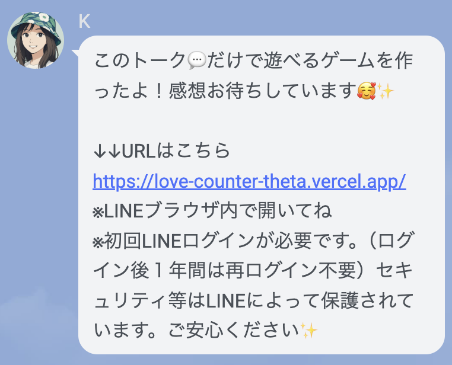
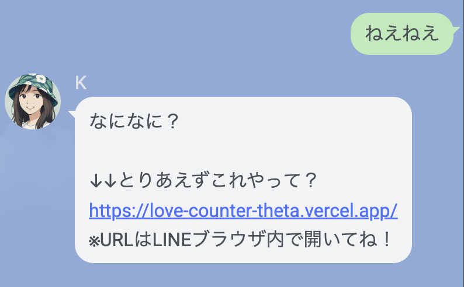

# 私のこと好き？ボタン

> りんごボタンを押すとランダムなメッセージが表示されるWebアプリ

> LINE連携で「緩く繋がれる」コミュニケーションツール

<br>
<br>

## プロジェクトの背景

このプロジェクトは、**退職後の起業準備**として、LINE Messaging APIを活用したビジネス展開を見据えて開発しています。
<br>
<br>
### 🌱 目的

- **LINE API の実践的な学習**
  LIFF（LINE Front-end Framework）、Messaging API、Webhookなど、LINEプラットフォームを使ったサービス開発のノウハウを習得

- **人との繋がりを大切にするツール**
  1対1のコミュニケーションを重視し、相手が思い出した時に気軽にメッセージを送れる「緩やかな繋がり」を提供

- **将来のビジネス展開の土台**
  複数のWebアプリを1つの公式LINEアカウントで管理する仕組みを構築し、スケーラブルなサービス設計を学ぶ

### 🌱 コンセプト

「緩く繋がれる公式LINE」

- 一斉配信ではなく、個別のやり取りを重視
- ユーザーが思い出した時にアプリからメッセージを送れる
- 管理者（運営者）が気まぐれに返信する、人間味のあるコミュニケーション
- Webアプリをコミュニケーションツールとして活用

### 💬 友達追加時のウェルカムメッセージ



### 🔑 キーワード自動応答

「**ねえねえ**」と送信すると、アプリのURLが自動で送られてきます。



### 📌 重要な仕様（フェーズ3）

現在の実装（`pushMessage`方式）では、以下の制約があります：

- ✅ アプリからLINEにメッセージを送信できる
- ❌ **ユーザーが一度も直接メッセージ/スタンプを送っていない場合、公式LINE管理画面にチャットが表示されない**

**対策：**
1. ユーザーに「最初に何か送ってね」と促す
2. フェーズ4で`liff.sendMessages()`方式に変更（ユーザー本人から送信する形式）

詳細は [フェーズ4実装ガイド](./docs/phase/phase4/liff-sendmessages-implementation.md) を参照
<br>
<br>

---

## 🌐 デモURL

- **Phase1**: [基本機能](https://love-counter-git-phase1-rs-projects-9c94598c.vercel.app/)
- **Phase2**: [Apple風デザイン](https://love-counter-git-phase2-rs-projects-9c94598c.vercel.app/)
- **Phase3**: [LINE連携版](https://love-counter-git-phase3-rs-projects-9c94598c.vercel.app/) ← 最新版


<br>
<br>

---

## 主な機能

- りんごボタンをクリックするとランダムメッセージを表示
- 押した回数を「好き度%」として表示
- 22回ごとに特別メッセージ＆キラキラアニメーション
- スマホ対応のレスポンシブデザイン
- 将来的にLINE連携予定
- **LIFF**: ユーザーごとに異なるLINE IDを自動取得
- **Webhook振り分け**: 1つのエンドポイントで複数アプリを管理
- **ユーザー管理**: 誰がどのアプリから送信したか識別可能

この仕組みにより、**スケーラブルで管理しやすいLINEサービス**を構築します。


<br>
<br>

---

## 🧱 技術スタック

**フロントエンド**
- HTML5 / CSS3（CSS変数、アニメーション、メディアクエリ）
- JavaScript（ES6）

**バックエンド（フェーズ3予定）**
- Node.js / Vercel Serverless Functions
- LINE Messaging API


<br>
<br>

---

## 📚 関連ドキュメント

### 基本ドキュメント
| ドキュメント | 内容 |
|-------------|------|
| **[📝 仕様書](./docs/spec.md)** | 画面構成、機能仕様、データ構造、実装詳細 |
| **[🎨 デザインコンセプト](./docs/DESIGN.md)** | Apple風デザイン、カラーパレット、SVGボタン |
| **[📈 フェーズ計画](./docs/PROJECT_PHASES.md)** | 開発ロードマップ、学習目標、実装状況 |
| **[📖 学習メモ](./docs/learning-notes.md)** | 技術的な学習記録 |

### フェーズ別ドキュメント
| フェーズ | ドキュメント | 内容 |
|---------|-------------|------|
| **Phase 2** | **[🔧 SVG調整ガイド](./docs/phase/phase2/SVG調整ガイド.md)** | りんごボタンのカスタマイズ方法 |
| **Phase 3** | **[🔗 LINE連携手順](./docs/phase/phase3/process.md)** | LIFF実装、Webhook設定、エラー解決 |
| **Phase 3** | **[📘 LIFF実装ガイド](./docs/phase/phase3/LIFF実装ガイド.md)** | LIFF詳細設定、トラブルシューティング |
| **Phase 4** | **[🔧 技術的な改善](./docs/phase/phase4/process.md)** | liff.sendMessages対応、2バージョン作成 |
| **Phase 4** | **[📖 liff.sendMessages実装ガイド](./docs/phase/phase4/liff-sendmessages-implementation.md)** | チャット表示問題の解決 |
| **Phase 5** | **[🚀 公式LINE運用計画](./docs/phase/phase5/process.md)** | リッチメニュー、ステップ配信、ビジネス展開（1〜3月） |

**詳細な仕様・データ構造は [📝 仕様書](./docs/spec.md) を参照してください**

<br>
<br>

---

## 📂 ディレクトリ構造

```
love-counter/
├── index.html              # メインHTML
├── script.js               # JavaScript処理
├── api/                    # Serverless Functions
│   ├── send-message.js     # LINE送信API
│   └── webhook.js          # Webhook受信API
└── docs/                   # ドキュメント
    ├── spec.md             # 仕様書
    ├── DESIGN.md           # デザインコンセプト
    ├── PROJECT_PHASES.md   # フェーズ計画
    └── ...
```
<br>
<br>

---

## 📈 開発ステータス

- ✅ **フェーズ1**: 基本機能（ランダムメッセージ、カウント、特別メッセージ）
- ✅ **フェーズ2**: Apple風デザイン（SVGりんごボタン、洗練されたUI）
- ✅ **フェーズ3**: LINE連携機能（LIFF実装、画像送信、返信フォーム）
- 🚧 **フェーズ4**: 技術的な改善（liff.sendMessages対応、2バージョン作成）
- 📅 **フェーズ5**: 公式LINE運用開始（リッチメニュー、ステップ配信、ビジネス展開）

詳細は [フェーズ計画](./docs/PROJECT_PHASES.md) を参照


---

**作成**: Claude Code
**最終更新**: 2025-12-12
